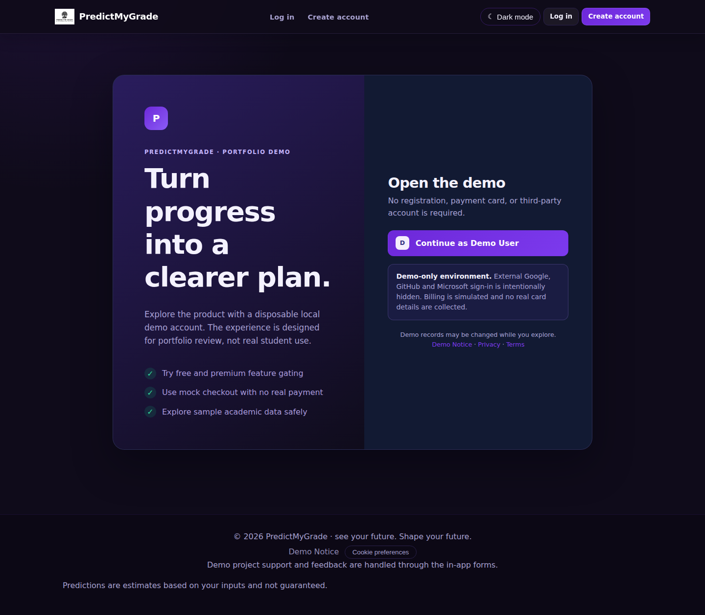

# PredictMyGrade Demo

[](https://github.com/PriceyLewis/PredictMyGrade-Demo/actions/workflows/ci.yml)

**Django · Python · SQLite · Playwright · product engineering**



[View the recruiter case study](https://priceylewis.github.io/projects/predictmygrade.html)

PredictMyGrade is a portfolio Django product demo for student progress tracking, grade forecasting, study planning, and freemium product journeys. **This repository is intentionally a demo, not a live product or production SaaS.**

## 60-second recruiter walkthrough

1. Start the app and choose **Continue as Demo User**.
2. Review the populated dashboard, modules and progress summaries.
3. Open **What If** to demonstrate scenario modelling.
4. Try a Premium-only surface such as AI Reports.
5. Use the mock upgrade flow and confirm Premium access.
6. Open Manage Plan and return to Free.
7. Re-open the Premium feature to show that state-backed gating is restored.

That journey is also covered by Playwright smoke tests in CI.

## Demo-Only Contract

The repository is designed so a recruiter or reviewer can explore realistic product behaviour without real billing or paid AI dependencies:

- Billing and subscriptions are simulated locally only.
- Checkout always returns to a local PredictMyGrade success route; no Stripe/card page is used.
- Reviewers can move from Free -> Premium -> Free to verify feature gating.
- Monthly and yearly prices are illustrative product-design values, not purchasable plans.
- The demo sign-in creates a disposable local account; third-party OAuth buttons are intentionally hidden.
- While mock billing is enabled, assistant replies are deterministic local demo responses and external OpenAI clients are blocked.
- Legal/privacy/cookie pages demonstrate product surface area only and are not production/compliance claims.

## What This Project Demonstrates

- End-to-end Django product architecture rather than a single isolated feature
- Authentication, persistence, settings, exports/imports, and account lifecycle flows
- Free/Premium feature gating backed by real application state
- Mock checkout, mock plan management, and downgrade behaviour
- Academic dashboards, weighted averages, forecasting, what-if tools, goals, deadlines, snapshots, and calendar export
- AI-style mentor/reporting experiences that remain usable without an API key
- Backend regression tests and Playwright browser smoke coverage

## Demo Walkthrough

1. Open `/accounts/login/` and choose **Continue as Demo User**.
2. Explore the Free experience and open a Premium-only feature such as AI Reports.
3. Choose **Try Premium** and select the mock monthly or yearly plan.
4. Confirm that Premium-only screens now open.
5. Open **Manage plan** to switch the illustrative plan or choose **Return to Free**.
6. Re-open a Premium-only feature to confirm that the Free gate is restored.

No card number, payment provider account, OAuth account, or OpenAI API key is required for this walkthrough.

## Core Features

- Student dashboard with weighted averages, progress summaries, and prediction-style metrics
- University, college/A-Level/BTEC, and GCSE-oriented tracking surfaces
- Module CRUD, search, validation, persistence, import/export, and backup/restore flows
- Study planning tools, goals, deadlines, snapshots, achievements, and calendar export
- AI-style reporting, mentor chat, planning helpers, and what-if forecasting demos
- Mock Premium checkout, plan switching, and immediate demo downgrade to Free
- Settings persistence, theme controls, privacy/data controls, and feedback/bug-report surfaces
- Admin/analytics screens for portfolio demonstration

## Tech Stack

- Python / Django 5
- SQLite for local/demo use; database configuration remains compatible with PostgreSQL for engineering reference
- django-allauth plumbing, with third-party provider UI intentionally hidden in this demo
- Local mock billing state; no payment processor integration is required
- Deterministic local assistant responses in demo mode
- Playwright for end-to-end browser smoke tests

## Architecture Notes

- `core/` contains models, views, forms, services, tasks, decorators, and tests
- `config/` contains Django settings, URL routing, WSGI/ASGI configuration
- `templates/` and `static/` provide the server-rendered frontend
- `e2e/` contains Playwright browser coverage, including Free -> Premium -> Free demo billing
- `docs/feature-verification.md` records audited feature coverage and remaining limitations

## Local Setup

1. Create and activate a virtual environment.
2. Install Python dependencies.
3. Copy `.env.example` to `.env`.
4. Run migrations.
5. Start the development server.

```powershell
python -m venv .venv
.venv\Scripts\Activate.ps1
pip install -r requirements.txt
Copy-Item .env.example .env
python manage.py migrate
python manage.py runserver
```

Open `http://127.0.0.1:8000/` and use the demo sign-in button.

## Environment Variables

Required for Django startup:

- `DJANGO_SECRET_KEY`
- `DATABASE_URL`

Recommended local/demo values:

```env
DJANGO_SECRET_KEY=dev-secret-key-change-me
DATABASE_URL=sqlite:///db.sqlite3
DJANGO_DEBUG=true
BILLING_MOCK_MODE=1
ONBOARDING_SAMPLE_DATA_ENABLED=true
```

`BILLING_MOCK_MODE` is intentionally enabled by the demo configuration. With mock billing enabled, the mentor path uses local simulated responses and the external OpenAI client refuses to initialise even if somebody accidentally supplies an API key.

## Main Routes

- `/accounts/login/` - disposable demo sign-in
- `/` and `/dashboard/` - main dashboard
- `/modules/` - module management
- `/what-if/` - scenario simulation
- `/reports/ai/` - Premium-gated AI-style report experience
- `/pricing/` and `/upgrade/` - mock plan selection
- `/manage-subscription/` - mock plan switching and return-to-Free controls
- `/settings/` - account/app preferences and data tools
- `/demo-notice/` - explicit demo limitations

## Testing

Backend checks:

```powershell
$env:DJANGO_SECRET_KEY='dev-secret-key'
$env:DATABASE_URL='sqlite:///db.sqlite3'
$env:DJANGO_DEBUG='true'
python manage.py check
python manage.py test
```

Playwright browser tests:

```powershell
npm install
npm run test:e2e
```

The Playwright configuration runs Django against a local SQLite database with mock billing and in-memory email. Browser coverage includes the demo login surface, Premium upgrade, Premium-only access, mock plan controls, and downgrade back to Free.

## Not A Production Runbook

`DEPLOYMENT.md` is retained only as engineering-reference material. This demo is not represented as ready for public launch. A real product would require a separate security, privacy, legal, billing, infrastructure, monitoring, support, abuse-prevention, and operational workstream rather than simply enabling hidden integrations in this repository.
